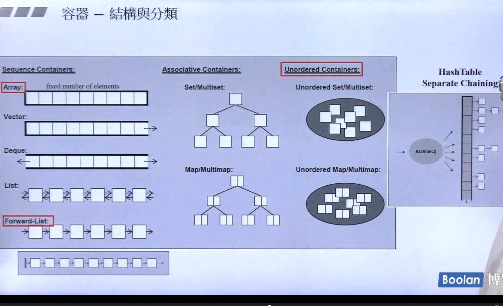
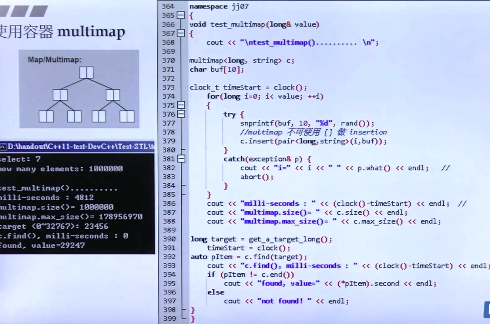

# STL标准库

    参考资料文档：./doc/slide.pdf


    以下三个是常用cpp网站资源:


# STL 六大部件


## 容器

    容器结构与分类：
        1.序列容器
        2.关联容器


### 顺序容器
    1、使用容器 array


       
    2、使用容器 vector
        note:vector的内存的扩展按照分配元素的2倍扩展


    
    3、使用容器 list forward_list


    4、使用容器 deque


    5、使用容器 stack queue


### 关联容器
    
    1、使用容器 multiset


    2、使用容器 multimap


    3、unordered_multiset


    4、 unordered_multimap


    5、 set

    
    6、map

    
    7. unordered_set


    8、unordered_map


## 分配器


## 算法

## 迭代器

## 适配器

## 仿函数

## OOP(面向对象编程) VS GP（Generic Programing）

    1、OOP ：数据 + 方法 放在类中
    2、GP 将数据和方法分开


## 源码分析

### 操作符重载


### 模板

### list

````c++

// GCC 2.9 版本

template <class T>
struct __list_node {
    typedef void* void_pointre;
    void_pointer prev;
    void_pointer next;
    T data;
};

template <class T, class Ref, class Ptr>
struct __list_iterator
{
    typedef __list_iterator<T, Ref, Ptr> self;
    typedef bidirectional_iterator_tag iterator_category;
    typedef T value_type;
    typedef Ptr pointer;
    typedef Ref reference;
    typedef __list_node<T>* link_type;
    typedef ptrdiff_t difference_type;
    
    link_type node;
    
    reference operator*() const { return (*node).data; }
    pointer operator->() const { return &(operator*()); }
    self& operator++() { node = (link_type)((*node).next); return *this; }
    self operator++(int) { self tmp = *this; ++*this; return tmp; }
    
};

template <class T, class Alloc = alloc>
class list {
protected:
    typedef __list_node<T> list_node;
public:
    typedef list_node* link_type;
    typedef __list_iterator<T, T&, T*> iterator;
protected:
    link_type node;
...
    
};


// Gcc 4.9 版本改进
template <class _Tp, class _Alloc = allocator<_Tp>>
class list : protected _List_base<_Tp, _Alloc>
{
public:
    typedef _List_iterator<_Tp> iterator;
};

template <class _Tp>
struct _List_iterator
{
    typedef _Tp* pointer;
    typedef _Tp& reference;
    ...
};

struct _List_node_base
{
    _List_node_base* _M_next;
    _List_node_base* _M_prev;
};

template<class _Tp>
struct _List_node : public _List_node_base {
    
    _Tp _M_data;
};

// Iterator需要遵循的原则

/*
 * 在容器和算法之间的桥梁迭代器，通常需要满足算法使用的需求，也就是算法要知道容器的数据类型，
 * iterator泛化指针的移动等信息，以下举例rotate函数的算法
 * */

template <class _Iter>
inline typename iterator_traits<_Iter>::iteraotr_category
__iterator_category(const _Iter&)
{
    return typename iterator_traits<_Iter>::iterator_category();
}

template <class _ForwardIterator>
inline void
rotate(_ForwardIterator __first, _ ForwardIterator __middle,
       _ForwardIterator __last)
{
    ...
    std::__ratate(__first, __middle, __last, std::iterator_category(__first));
}

template<calss _RandomAccessIterator>
void __rorate(_RandomAccessIterator __first,
              _RandomAccessIterator __middle,
              _RandomAccessIterator __last,
              random_access_iterator_tag)
{
    ...
    typedef typename iterator_traits<_RandomAccessIteraot>::difference_type _Disrance;
    typedef typename iterator_traits<_RandomAccessIterator>::value_type _ValueType;
    _Distance __n = __last - __first;
    _Disrance __k = __middle - __fisrt;
    ...
    for (;;) {
        if (__k < __n - __k) {
            if (__is_pod(_ValueType) && __k == 1) {
                _ValueType __t = _GLIBCXX_MOVE(*__p);
            }
        }
    }
    ...
}

````

### vector

```c++

// GCC 2.9 版本
template <calss T, class Alloc = alloc>
class vector {
public:
    typedef T value_type;
    typedef value_type* iterator; // T*
    typedef value_type& reference;
    typedef size_t size_type;
protected:
    iterator start;
    iterator finish;
    iterator end_of_storage;
public:
    iterator begin() { return start; }
    iterator end() { return finish; }
    size_type size() const { return size_type(end() - begin()); }
    size_type capacity() const { return size_type(end_of_storage - begin());}
    bool empty() { return begin() == end(); }
    reference operator[](size_type n) { return *(begin() + n);}
    refefence front() { return *begin();}
    reference back() { return *(end() - 1);}
    
};

template <class T, class Alloc>
void vector<T, Alloc>::insert_aux(iterator position, const T& x)
{
    if (finish != end_of_storage) {
        cosntruct(finish, *(finish - 1));
        ++finish;
        T x_copy = x;
        *position = x_copy;
    } else {
        const size_type old_size = size();
        const size_type len = old_size != 0 ? 2 * old_size : 1;
        
        iterator new_start = data_allocator::allocate(len);
        iterator new_finish = new_start;
        try {
            new_finish = uninitialized_copy(start, position, new_start);    // 拷贝原内容
            construct(new_finish, x);   // 插值
            ++new_finish;
            new_finish = uninitialized_copy(position, finish, new_finish); // 后半部分拷贝
        } catch(...) {
            destory(new_start, new_finish);
            data_allocator::deallocate(new_start, len);
            throw;
        }
        destory(begin(), end());    // 释放原空间
        deallocate(); // 调整迭代器，指向新vector
        start = new_start;
        finish = new_finish;
        end_of_storage = new_start + len;
    }
}

void push_back(const T& x)
{
    if (finish != end_of_storage) {
        construct(finish, x);
        ++finish;
    } else {
        insert_aux(end(), x);
    }
}


// GCC 4.9 版本

/*
 * vector iterator
 * */

using std::iterator_traits;
using std::iterator;
template<typename _Iterator, typename _Container>
class __normal_iterator
{
protected:
    _Iterator _M_current;
    typedef iterator_traits<_Iterator> __traots_type;
public:
    typedef _Iterator iterator_type;
    typedef typename __traits_type::iterator_category iterator_category;
    typedef typename __traits_type::value_type value_type;
    typedef typename __traits_type::difference_type diffrence_type;
    typedef typename __traits_type::reference_type reference_type;
    typedef typename __traits_type::pointer pointer;
};

template<class _Tp, class _Alloc = std::allocator<_Tp>>
class vector : protected _Vector_base<_Tp, _Alloc>
{
    ...
    typedef _Vector_base<_Tp, _Alloc> _Base;
    typedef typename _Base::pointer pointer;
    typedef __gnu_cxx::__normal_interator<pointer, vector> iterator;
    
    ...
};


```

### array

```c++
// GCC 2.9
template<class _Tp, std::size_t _Nm>
struct array
{
    typedef _Tp value_type;
    typedef _Tp* pointer;
    typedef value_type* iterator;
    
    value_type _M_instancep[_Nm ? _Nm : 1];
    iterator begin() { return iterator(&_M_instance[0]); }
    
    iterator end() { return iteratro(&_M_instance[_Nm]); }
};

// Gcc 4.9
template<class _Tp, std::size_t _Nm>
struct array {
    typedef _Tp value_type;
    typedef value_type* pointer;
    typedef value_type& reference;
    typedef value_type* iterator;
    typedef size_t size_type;
    
    typedef _GLIBCXX_STD_C::__array_traits<_Tp, _Nm> _AT_Type;
    typename _AT_Type::_Type _M_elems;
    
    itarator begin() noexcept { return iterator(data()); }
    iterator end() noexcept { return iterator(data() + _Nm);}
    ...
    
};


```

### forward list
### deque
### stack
### queue
    见文档描述

## 关联式容器

### rb_tree

```c++

// GCC 2.9
template<class T>
struct __rb_tree_node {
    void* parent;
    void* left
    void* right;
};

template<class Key, class Value, class KeyOfValue, class Compare, class Alloc = alloc>
class rb_tree {
protected:
    typedef __rb_tree_node<Value> rb_tree_node;
    ...    
public:
    typedef rb_tree_node* link_type;
    ...
protected:
    //RB_tree 数据成员
    size_type node_count;
    link_type header;
    Compare key_compare;    // key的大小比较规则，仿函数队形
    
};

// for example

template<class Arg, class Result>
struct unary_function {
    typedef Arg argument_type;
    typedef Result result_type;
};

template<class T>
struct identity : public unary_function {
    const T& operator()(const T& x) {return x;}
};

template<class Arg1, class Arg2, class Result>
struct binary_function {
    typedef Arg1 first_argument_type;
    typedef Arg2 second_argument_type;
    typedef Result result_type;
};

template<class T>
struct less : public binary_function<T, T, bool> {
    bool operator()(const T& x, const T& y) cosnt { return x < y; }
};

rb_tree<int, int, identity<int>, less<int>, alloc> myTree;


```

### hashtable
 
```c++
template<class Value>
struct __hashtable_node {
    __hashtable_node* next;
    Value val;
};

template<class Value, class Key, class HashFcn, class ExtractKey, class EqualKey, class Alloc>
struct __hashtable_iterator {
    ...
    node* cut;
    hashtable* ht;
}

template<class Value, class Key, class HashFcn, class ExtractKey, class EqualKey, class Alloc=alloc>
class hashtable {
public:
    typedef HashFcn hasaher;
    typedef EqualKey key_equal;
    typedef size_t size_type;
    
private:
    hasher hash;
    key_equal equlas;
    ExtractKey get_key;
    
    typedef __hashtable_node<Value> node;
    vector<node*, Alloc> buckets;
    size_type num_elements;
public:
    size_type bucket_count() const { return buckets.size(); }
    ...    
    
};


// 应用
hashtable<const char*, const char*, hash<const char*>,
        identity<const char*>, eqstr, alloc> ht(50,hash<const char*>(), eqstr());

ht.insert_unique("kiwi");
ht.insert_unique("plum");
ht.insert_unique("apple");

struct eqstr {
    bool operator()(const char* s1, const char* s2) { return strcmp(s1, s2) == 0; }
};


// 使用容器unordered_set

void test_unordered_set(long& value)
{
    cout << "\ntest_unordered_set() .... \n" << endl;
    
    unordered_set<string> c;
    char buf[10];
    clock_t timeStart = clock();
    
    for (long i = 0; i < value; ++i) {
        try {
            snprintf(buf, 10, "%d", rand());
            c.insert(string(buf));
        } catch (exception& p) {
            cout << "i" << i << " " << p.what();
            abort();
        }
    }
    
    cout << "multi_seconds : " << (clock() - timeStart) << endl;
    cout << "unordered_set.size() = " << c.size() << endl;
    cout << "unordered_set.max_size()  = " << c.max_size() << endl;
    cout << "unordered_set.buckets_count() = " << c.bucket_count() << endl;
    cout << "unordered_set.load_factor() = " << c.load_factor() << endl;
    cout << "unordered_set.max_bucket_count() = " << c.max_buckets_count() << endl;
}
```


## 算法

### 迭代器的分类
 
### 算法示例
    
    qsort(c)

    bsearch(c)
    
    c++ 算法符合 algorithm(iterator first iterator last)
    count_if

    find

    accumulate

    for_each
    
    replace replace_if raplace_copy
    
    count count_if
    
    find find_if

    sort
    
    reverse_iterator rbegin rend

    binary_search lower_bound up_bound

## 仿函数 functors
    
    算数类

    逻辑类

    相对关系类
 
    继承  unary_function bianry_function 为了后续的其他一些适配器的使用
 

## Adapters  适配器 改造器
    
    实现方式：使用B来实现A的功能，这里统一使用了符合关系

### 容器适配器
    
    stack queue 使用双向deque来实现功能和改造

### 迭代器适配器  Iterator adapters
    reverse_iterator
    inserter
    ostream_iterator
    istream_iterator

### 仿函数适配器 function adatpter
    
    binder2nd ： 把东西记起来供后面使用

### 新型适配器 bind
    
    bind 可以绑定：
    1、functions
    2、function objects
    3、member functions, _1必须是某个object地址
    4、data members, _1必须是某个object地址

    其实以上就是先进行参数的绑定到上述之一。

```c++
    vector<int> v{15, 37, 94, 50, 73, 58, 28, 98};
    count_if(v.cbegin(), v.cend(), bind(less<int>(), _1, 50));
    count_if(v.cebegin(), v.cend(), not1(bind2nd(less<int>(), 50)));

```


# 第四讲

## 一个万用的hash function
    自定义的对象元素在使用unordered_map unordered_set的时候需要自己设计哈希表
    使用形式：仿函数 函数指针

