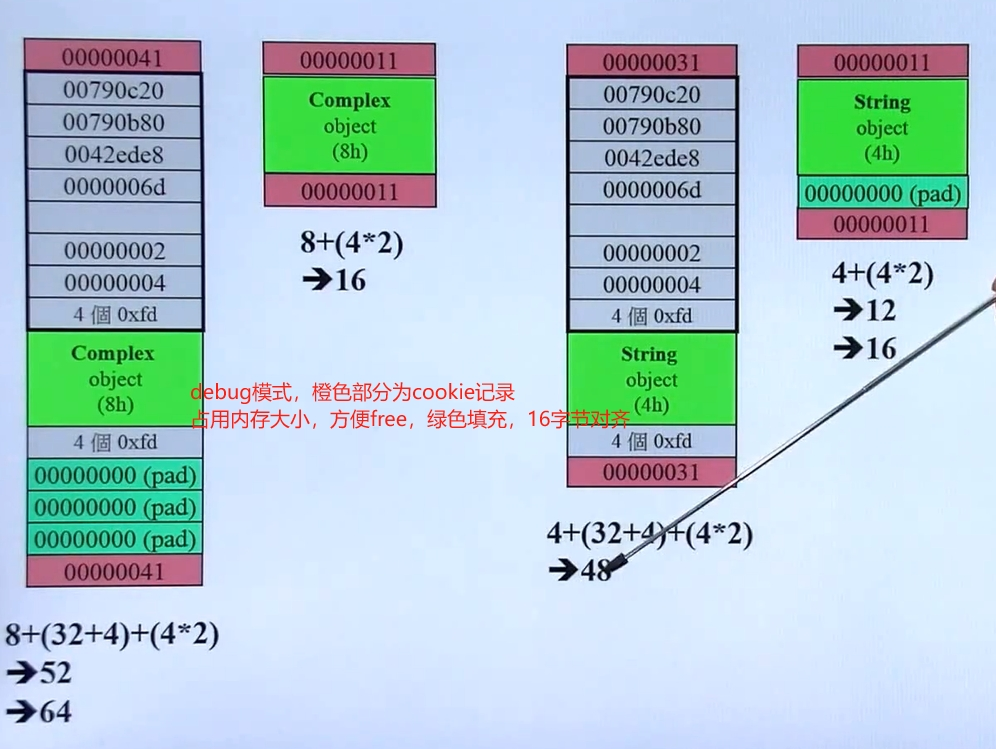
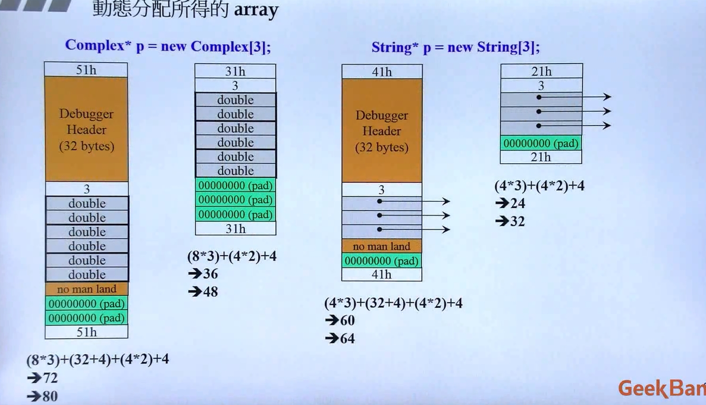
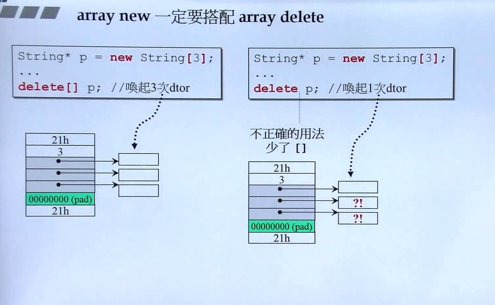
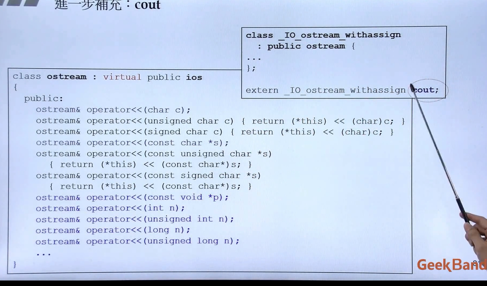
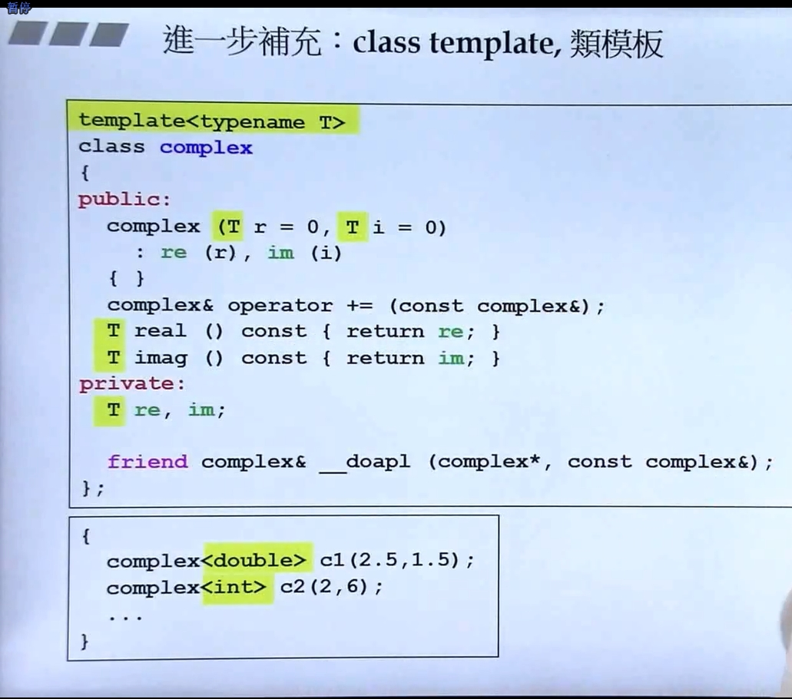
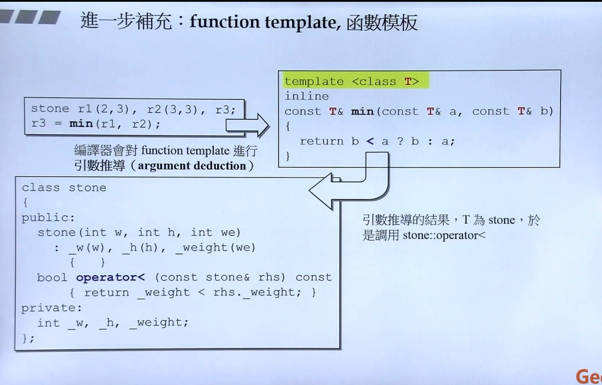
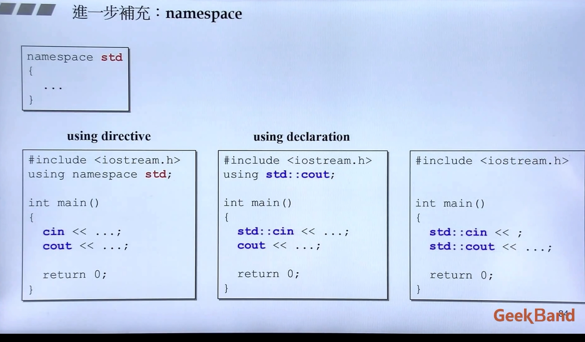
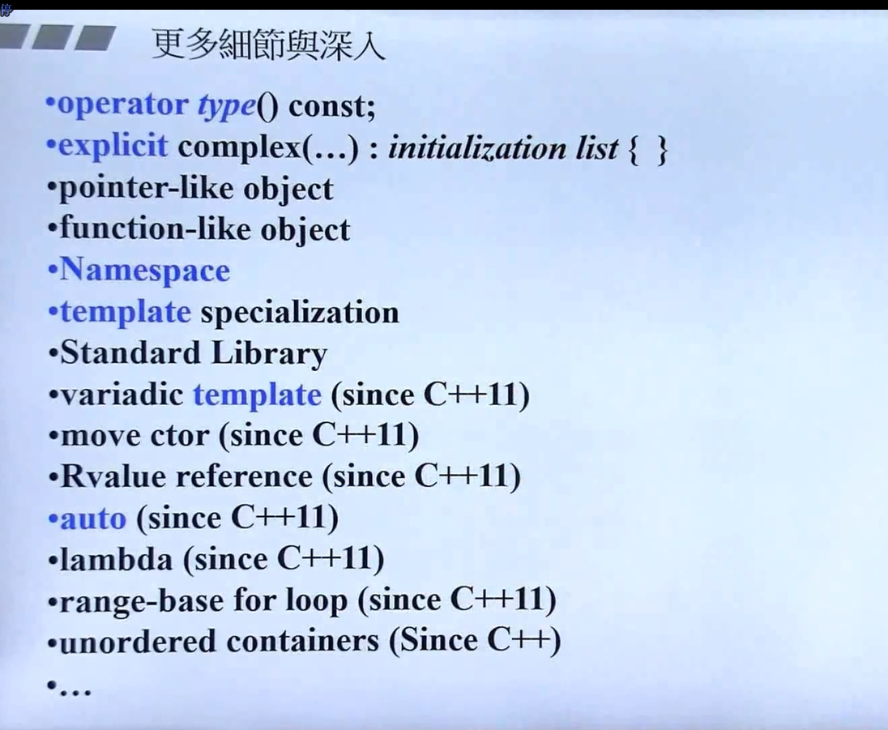

# 目标

## class without pointer member（基于对象）
    例如: Complex
 

## class with pinter member （面向对象）
    例如: String

## 类之间的关系
### 继承
### 复合
### 委托

## 构造函数
    1.列表初始化
    2.默认参数
    3.私有构造函数
## 常量成员函数
    const

## 模板

## 单例

## 参数传递
    1、pass by value
    2、pass by reference(const)

## 返回值传递
    1、return by value
    2、return by reference(const)

## 友元

    相同class的各个objects互为友元函数
```c++
class Complex {
public:
    Complex() = default;
    Complex(double real, double imag) : re(real), im(imag) {
            
    }

    double fund(Complex& rhs) {
        return rhs.re + rhs.im;
    }
private:
    double re;
    double im;
}
Complex c1(2,1)
Complex c2;
double ret = c2.func(c1);

```


## 操作符重载

    1、成员函数 this
        任何类的成员函数都有一个隐形的参数this，例如：
````c++
inline Complex& __doapl(Complex* ths, Complex& rhs)
{
    ths->re += rhs.re;
    ths->im += rhs.im;
    return *ths;
}

inline Complex& Complex::operator += (const Complex& rhs)  // 隐藏了指针this参数
{
    return __doapl(this, rhs);
}

Complex c1(5,4);
Complex c2;
c2 += c1;

// 返回引用是为了连续操作  例如： c3+=c2+=c1
````

    2、操作符重载-2 非成员函数 无this
````c++
    // 为了应付cilent的三种可能写法，这里对应开发三个函数
    // 临时对象 typename();

inline Complex operator + (const Complex&x, const Complex& y)
{
    return Complex(x.re + y.re, x.im + y.im);
}


inline Complex operator + (const Complex& x, double y)
{
    return Complex(x.re +y, x.im);
}

inline Complex operator + (double x, const Complex& y)
{
    return Complex(x + y.re, y.im);
}

Complex c1(2,1);
Complex c2;

c2 = c1 + c2;
c2 = c1 + 5;
c2 = 7 + c1;

    // 一元操作符 一个参数 
inline Complex operator + (const Complex& rhs)
{
    return rhs;
}

inline Complex operator - (const Complex& rhs)
{
    return Complex(-rhs.x, -rhs.y);
}

    // 操作符重载 逻辑运算符
inline bool operator == (Complex& x, Complex& y)
{
    return (x.re == y.re) && (x.im == y.im);
}

inline bool operator == (Complex& x, double y)
{
    return (x.re == y) && (x.im == 0);    
}

inline bool operator == (double x, Complex& y)
{
    return (x == y.re) && (y.im == 0);
}

Complex c1(2,1)
Complex c2;
cout << (c1 == c2);
cout << (c1 == 2);
cout << (0 == c2);

inline bool operator != (Complex& x, Complex& y)
{
    return (x.re != y.re) || (x.im != y.im);
}

inline bool operator != (Complex& x, double y)
{
    return (x.re != y) || (x.im != 0);
}

inline bool operatro != (double x, Complex& y)
{
    return (x != y.re) || (y.im != 0);
}

cout << (c1 != c2);
cout << (c1 ! = 2);
cout << (0 != c2);

// 操作符重载 << 输出符  只能当做全局操作符  类成员没有ostream对象
#include <iostream>
ostream& operator << (ostream& os, const complex& x)
{
    return os << "(" << x.re << "," << x.im << ")";
}

// 总结 如果是全局操作符重载，没有this成员，所有需要将操作对象当做参数传入，如果是类成员操作，this作为隐藏参数

````


# class with pinter member(s)
    类中带有指针的一定要有以下三个函数  BIG THREE  拷贝构造 拷贝赋值  析构函数
## 拷贝构造

```c++
inline String::String(const String& str)
{
    mData = new char[strlen(str.mData) +1];
    strcpy(mData, str.mData);
}

String s1("hello");
String s2 = s1;
String s2(s1);

```


## 拷贝赋值


```c++
inline String& String::openrator = (const String& rhs)
{
    if (this == rhs) {
        return *this;
    }
    delete[] mData;
    mData = new char[strlen(rhs.mData) + 1];
    strcpy(this->mData, rhs.mData);
    return *this;
}

```
## 析构函数

```c++

inline String::~String()
{
    delete[] mData;
}

```

    字符串输出

```c++

#include <iostream>
ostream& operator << (ostream& os, String& str)
{
    os << str.getString();
}

```

# stack heap

    stack:是存在于某作用域的一块内存空间。例如当你调用函数，函数本身即会形成一个stack用来放置它所接受的参数，以及返回地址
    heap:是指由操作系统提供的一块全局内存空间，程序可动态分配后从中获取若干区块
```c++

class Cmplex {......};
...

{
    Complex c1(1,2); // c1便是所谓的stack obj，其生命在作用域结束之后结束。哲宏作用域内的obh，又成为audo obj，自动清理调用析构函数
}

{
    static Complex c2(1,2);
    // c2 是static obj，其生命在作用域结束之后仍然存在，知道整个程序结束。
}

Complex c3(1,2);
// c3 是全局对象 生命周期在于整个程序结束期间。

```

## new:先分配memory，然后调用构造函数

```c++

Complex *pc = new Complex(1,2);

// 编译器转化为一下三步

1. void* mem = operator new(sizeof(Complex));   // 内部调用malloc函数
2. pc = static_cast<Complex*>(mem);
3. pc->Complex::Complex(1,2);

```

## delete: 先调用析构函数，然后释放内存

```c++

String* PS = new Straing("hello");
deleta ps;

String::~String(ps);
operator delete(ps);    // 释放内存，内部执行free

```

## 内存分配图



    
    array new一定要搭配 array delete



# static

## static函数调用方式
    1.通过object调用
    2.通过class name直接调用

```c++

class Acount {
    public:
    static double m_rate;
    static void set_rate(double rate) { m_rate = rate; }
};

double Acount::m_rate = 8.0;

int main()
{
    Acount:set_rate(5.0);
    
    Acount a;
    a.set_rate(7.0);  
    return 0;
}


```

# 把构造函数放在private

## 单例模式

```c++

class Singleton {
    public:
    static Singleton& getInstance() {
        static Singleton single;    // 调用才存在
        return single;
    }
    void setup() {}
    private:
    Singleton() = default;
    Singleton(const Singleton& rhs) = default;
    Singleton& operator = (const Singleton& rhs) = default;
};

Singleton::getInstance().setup();
```

# cout


```c++

class ostream : virtual public ios
{
    public:
    ostream& operator << (char c);
    ostream& operator << (unsinged char c) { return (*this) << (char)c; };
    ......
};

class _IO_ostream_withassign : public ostream {
    ......
};

extern _IO_ostream_withassign cout;

```

# 模板



```c++

template<class T>
class complex {
    public:
    complex(T r = 0, T i = 0) : re(r), im(i) {
        
    }
    T real() const {
        return re;
    }
    
    T imag() const {
        retutn im;
    }
    private:
    T re;
    T im;
    friend complex& __doapl(complex*, const conplex&);
};

{
    complex<double> c1(1.1,2.2);
    complex<int> c2(3.4);
}
```

## 函数模板

```c++
class stone
{
    public:
    stone(int w, int h, int we) : _w(w), _h(h), _we(we) {}
    
    bool operator < (const stone& rhs) {
        return this->_weight < rhs._weight;
    }
    private:
    int _w, _h, _weight;
};

template<class T>
inline const T& min(T& a, T& b)
{
    return a < b ? a : b;
}

stone r1(2,3), r2(3,3), r3;
r3 = min(r1, r2);
```

# namespace


# 更多细节



# operator 第二种用法 隐式转换  operator type()  差别于  operate 操作符

```c++
template <typename T>
class string_cast
{
public:
    string_cast(const std::string &from): m_from(from) {
        cout << "ctor" << endl;
    }
    operator T() const {   
        cout << "yinshi zhuanhuan" << endl;
        std::stringstream sstr(m_from);
        T ret;
        try {
            sstr >> ret;
        }
        catch(std::exception &e)
        {
            return T(0);
        }
        return ret;
    }
private:
    const std::string &m_from;
};

cout << string_cast<int>("12345") << endl;

// 打印 ctor yinshi zhuanhuan 12345

```

# 面向对象编程与设计

## Inheritance(继承)

## Composition(复合)

## Delegation(委托)

